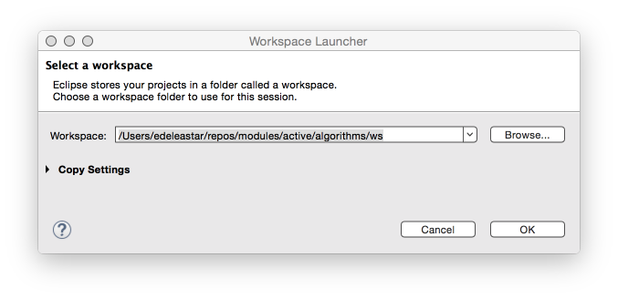

#Workspaces in Eclipse

A workspace is a logical collection of projects. A workspace is a directory on your hard drive where Eclipse stores the projects that you define to it. When you specify this directory name to Eclipse, Eclipse will create some files within this directory to manage the projects. This becomes the standard location for your Eclipse working directory

On this startup screen, Eclipse prompts you for the location of the workspace. Create a directory on a USB drive or a network share and use this as your workspace for ALL subsequent Algorithms work

Substitute in your own specific workspace path in the above as necessary

The following recommendation is made:

- Create a directory just for the workspace outside of the Eclipse install directory, on a persistent and portable location
- E.g. H:\eclipse_workspace
- Use that directory as your one and only workspace to manage most of your projects. 
- Specify that directory each time you startup Eclipse
- If you are using Eclipse on your own laptop, set this as the default (option available on startup)

For all subsequent labs, it is assumed that:

- You are using the same workspace
- All previous labs have been completed
- Any supplementary libraries are available (you will be informed when these are needed)
- Your code is working correctly
- If you have difficulty with this, please inform your tutors immediately

