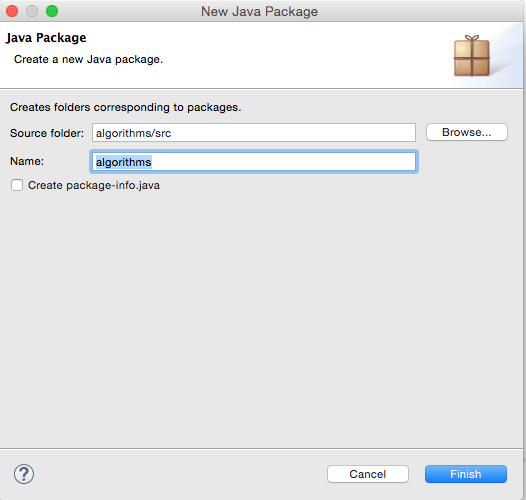

#Create a new project

##Open Eclipse

Set your workspace to your persistent area (memory stick, network drive) Wherever you created your workspace last time!

##Create a new Project called algorithms

Select `File - >New -> Project -> Java Project`

##Eclipse: create a new package

Inside the algorithms project, create a new package, also called algorithms

##Eclipse: Create an Interface

In the algorithms package, create a new interface, called `HelloWorldInterface`

Right-click on algorithms Package and Select New –> Interface

##Eclipse: Specifying a method 

Next, we shall specify a method display() in the Interface.  Recall interfaces only identify methods, and do NOT implement them (a WHAT operation)

Add the following line to your interface, so that it resembles:

~~~
public interface HelloWorldInterface 
{
  public void display();
}
~~~
