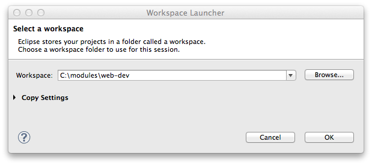

#Title 2

##Subtitle 

Lorem ipsum dolor sit amet, consectetur adipisicing elit, sed do eiusmod tempor incididunt ut labore et dolore magna aliqua. Ut enim ad minim veniam, quis nostrud exercitation ullamco laboris nisi ut aliquip ex ea commodo consequat. 

Code Block for Html:

~~~html

  <header class="ui middle aligned two column raised grid segment"> 
    

      

       <h1> {{course.title}} </h1>
      

      

        
      
 
    

  </header>
~~~

Lorem ipsum dolor sit amet, consectetur adipisicing elit, sed do eiusmod tempor incididunt ut labore et dolore magna aliqua. Ut enim ad minim veniam, quis nostrud exercitation ullamco laboris nisi ut aliquip ex ea commodo consequat. 

Code Block for Java:

~~~java
  public static Result updateUser(Long id)
  {
    Result result = notFound();
    User user = User.findById(id);
    if (user != null)
    {
      User updatedUser = renderUser(request().body().asJson().toString());
      user.update(updatedUser);
      user.save();
      result = ok(renderUser(user));
    }
    return result;
  }
~~~

- Duis aute irure dolor in reprehenderit in voluptate velit esse cillum dolore eu fugiat nulla pariatur. 
- Excepteur sint occaecat cupidatat non proident, sunt in culpa qui officia deserunt mollit anim id est laborum.

Lorem ipsum dolor sit amet, consectetur adipisicing elit, sed do eiusmod tempor incididunt ut labore et dolore magna aliqua. Ut enim ad minim veniam, quis nostrud exercitation ullamco laboris nisi ut aliquip ex ea commodo consequat. 

