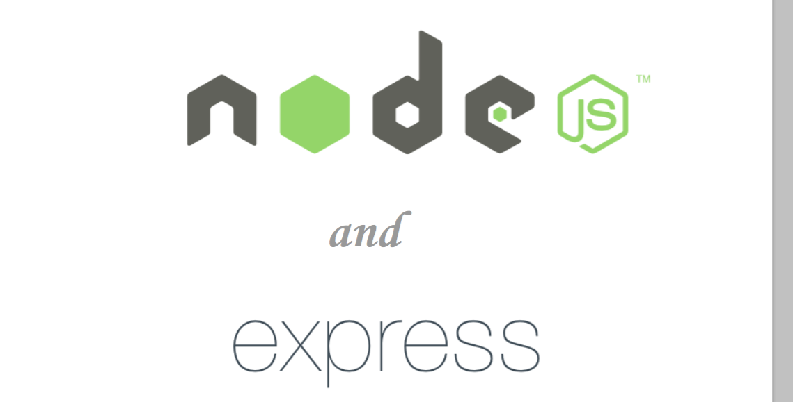

Lab 7: Node and Express 2
=======

In the previous lab you have used node.js to run javascript programs on the "server-side" which are capable of servicing HTTP requests.  In this lab you will add more functionality to the server side scripts. This lab will introduce you to the following:
- define a web API for your service
- separate routing out into a routing script
- do more advanced routing based on the HTTP verb
- test your solution with a suitable Rest Client